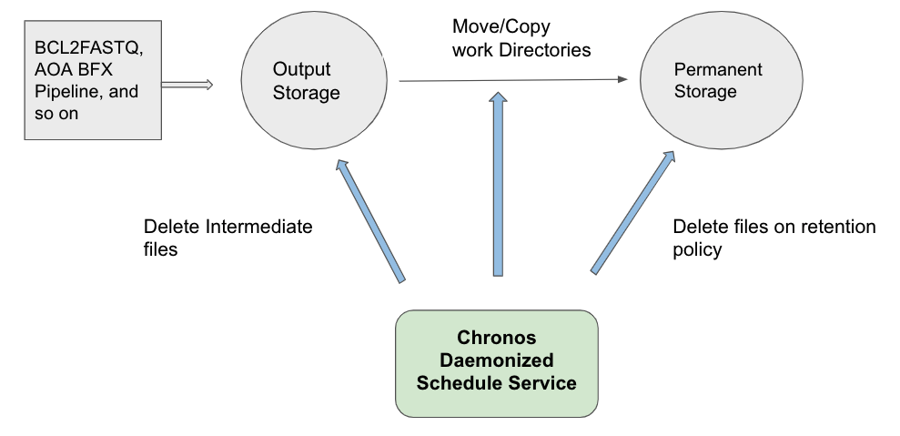
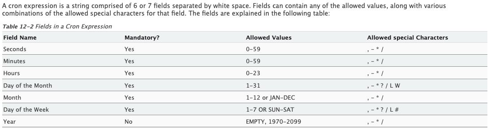
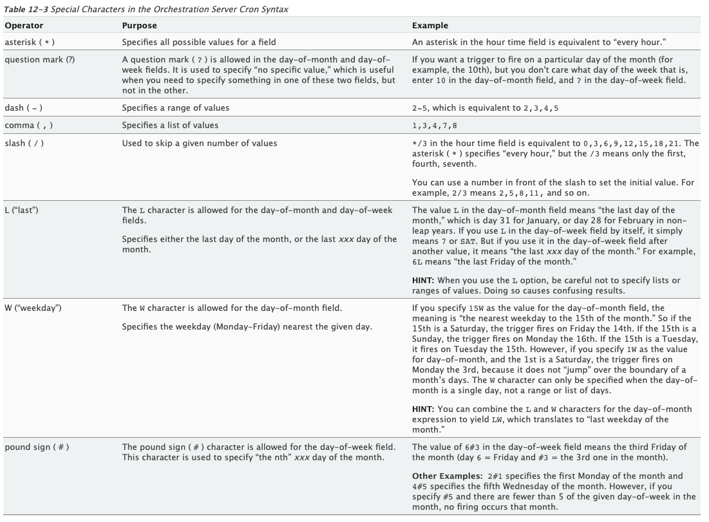

# chronos
Chronos is Data Manager Software used for Lannister. It is build on Java Spring Boot framework.
Using a config.json file, user can define a list of tasks. Each task will be described along with syntax.
The list of tasks will be registered into job scheduler. The scheduler will dispatch the registered tasks
based on their cron-expression defined in the config.json.

# Overview

Using a configuration file (.json), chronos can do:
1. removing files
2. moving/copying files from temporary directory and permanent directory while keeping the same directory structure between the source dir and the target dir
3. managing files with its retention policy




# Components

## Task
Task is described as an object in config.json. Task consists of seven fields:
* action - defines a commands among move, delete, and copy. 
* source - defines a directory that contains the app source to run the command. 
* target - defines a destination directory to which files are sent.
* name - defines directory or file name. 
  * Using a symbol(\*), the name can represent more than one file. 
* type - defines file type.
  * "d" represents directory while "f" represent file
  * The default value is both "d" and "f".
* cronSchedule - defines cron expression.
  * cron expression must have six fields separated by space.
  * For detail, please see the section TaskSchedulerService.
* retention - defines retention policy in day.
  * It is allowed to use floating point numbers.
  * For example, 1.5 (day) will be converted to 1.5 * 24 * 60.
* maxRetention - defines retention policy in day files and directories "older" than this value will not be proceeded. 
  * It is allowed to use floating point numbers.
  * For example, 1.5 (day) will be converted to 1.5 * 24 * 60.
* maxDepth - Maximum level of subdirectories to scan and apply the rule (Descend at most levels (a non-negative integer) levels of directories below the starting-points.),
* minDepth - Minimum level of subdirectories to scan and apply the rule (Do not apply any tests or actions at levels less than levels (a non-negative integer).),
* expectedExecutionTime - expected time of each job execution in minutes. Job's run will not be interrupted, but if it will exceed expected time than warning email will be send.
* listOfRecipients - list of recipient(s) in format: "XX.XX@roche.com, YY.YY@roche.com",
* taskDescriptionForEmailNotification - message that will be included into the email if job's execution time will exceed expected one. Format: "AOA Pipeline, copy files configuration",
* comment - String to describe task
* verbose - true/false. If true, then a list of files processed by the command will be added to the log file

### Field Requirement along with Action

| field                 |      move      |          delete           |         copy           |
|-----------------------|----------------|---------------------------|----------------------- |
| source                |      Yes       |            Yes            |          Yes           | 
| target                |      Yes       |            N/A            |          Yes           |
| name                  |      Yes       |            Yes            |          Yes           |
| type                  |      Optional  |            Optional       |          Optional      |
| cronSchedule          |      Yes       |            Yes            |          Yes           |
| retention             |      Yes       |            Yes            |          Yes           |
| maxRetention          |      Yes       |            Yes            |          Yes           |
| minDepth              |      Yes       |            Yes            |          Yes           |
| maxDepth              |      Yes       |            Yes            |          Yes           |
| expectedExecutionTime |      Yes       |            Yes            |          Yes           |
| listOfRecipients      |      Yes       |            Yes            |          Yes           |
| comment               |      Optional  |            Optional       |          Optional      |
| verbose               |      Optional  |            Optional       |          Optional      |


## TaskSchedulerService 
Each of tasks is registered and scheduled along with its cron exepression.

### Cron expression for cronTrigger
https://www.netiq.com/documentation/cloud-manager-2-5/ncm-reference/data/bexyssf.html

#### Format



#### Special Characters



#### Example of Cron Syntax
https://www.quartz-scheduler.org/api/1.8.6/index.html?org/quartz/CronTrigger.html

|      Expression            |        Meaning                                     |
|----------------------------|--------------------------------------------------- |
|"0 0 12 * * ?"              |Fire at 12pm (noon) every day                       |
|"0 15 10 ? * *"             |Fire at 10:15am every day                           |
|"0 15 10 * * ?"		     |Fire at 10:15am every day                           |
|"0 15 10 * * ? *"		     |Fire at 10:15am every day                           |
|"0 15 10 * * ? 2005"		 |Fire at 10:15am every day during the year 2005      |
|"0 * 14 * * ?"		         |Fire every minute starting at 2pm and ending at 2:59pm, every day |
|"0 0/5 14 * * ?"	      	 |Fire every 5 minutes starting at 2pm and ending at 2:55pm, every day|
|"0 0/5 14,18 * * ?"		 |Fire every 5 minutes starting at 2pm and ending at 2:55pm, AND fire every 5 minutes starting at 6pm and ending at 6:55pm, every day|
|"0 0-5 14 * * ?"		     |Fire every minute starting at 2pm and ending at 2:05pm, every day|
|"0 10,44 14 ? 3 WED"		 |Fire at 2:10pm and at 2:44pm every Wednesday in the month of March.|
|"0 15 10 ? * MON-FRI"		 |Fire at 10:15am every Monday, Tuesday, Wednesday, Thursday and Friday|
|"0 15 10 15 * ?"		     |Fire at 10:15am on the 15th day of every month       |
|"0 15 10 L * ?"		     |Fire at 10:15am on the last day of every month       | 
|"0 15 10 ? * 6L"		     |Fire at 10:15am on the last Friday of every month.   |
|"0 15 10 ? * 6L"		     |Fire at 10:15am on the last Friday of every month.    |
|"0 15 10 ? * 6L 2002-2005"	 |Fire at 10:15am on every last Friday of every month during the years 2002, 2003, 2004 and 2005|
|"0 15 10 ? * 6#3"		     |Fire at 10:15am on the third Friday of every month|


## Log
All of dispatched tasks will be recorded under "logs" directory.
* The logs directory will be created where chronos.jar is called.
* The log file will be accumulated and backuped when it reaches a certain size (5MB).

# Task Exampls
## move

```
  {
    "action": "move",
    "source": "/home/kimh89/test",
    "target": "/home/kimh89/test_target",
    "name": ["test*",
             "freq*"],
    "type": "d",
    "cronSchedule" : "0 45 1 * * ?",
    "retention": "1"
  }
```

* The task is to move any directory name starting with "test" or "freq" from a location (/home/kimh89/test) to a new location (/home/kimh89/test_target), 
only if the directory is older than 1 day or (1 * 24 * 60) minutes.
* The move task will be triggered 1:45AM every day. 

## delete
```
  {
    "action": "delete",
    "source": "/home/kimh89/test",
    "target": "",
    "name": ["*alignment_summary_metrics.txt",
             "*MIDtrimmed.bam*"],
    "cronSchedule" : "0 0 12 * * ?",
    "retention": "1.5"
  }
```
* The task is to delete any file ending with "alignment_summary_metrics.txt" or containing "MIDtrimmed.bam" in a location (/home/kimh89/test),
only if the file is older than 1.5 day or (1.5 * 24 * 60) minutes.
* The deletion task will be triggered 12:00PM every day.

## copy
```
  {
    "action": "copy",
    "source": "/home/kimh89/test",
    "target": "/home/kimh89/test_target",
    "name": ["freq*",
             "*demultiplexed_R2.fastq"],
    "cronSchedule" : "0 10 23 * * ?",
    "retention": "1"
  }
```
* The task is to copy any directory name starting with "freq" and any file name ending with "*demultiplexed_R2.fastq" 
from a location (/home/kimh89/test) to a new location (/home/kimh89/test_target),  
only if the directory is older than 1 day or (1 * 24 * 60) minutes.
* The copy task will be triggered 11:10PM every day.
* Finally, you can create your config.json file with all the task.

```
[
  {
    "action": "move",
    "source": "/home/kimh89/test",
    "target": "/home/kimh89/test_target",
    "name": ["test*",
             "freq*"],
    "type": "d",
    "cronSchedule" : "0 45 1 * * ?",
    "retention": "1"
  },
  {
    "action": "delete",
    "source": "/home/kimh89/test",
    "target": "",
    "name": ["*alignment_summary_metrics.txt",
             "*MIDtrimmed.bam*"],
    "cronSchedule" : "0 0 12 * * ?",
    "retention": "1.5"
  },
  {
    "action": "copy",
    "source": "/home/kimh89/test",
    "target": "/home/kimh89/test_target",
    "name": ["freq*",
             "*demultiplexed_R2.fastq"],
    "cronSchedule" : "0 10 23 * * ?",
    "retention": "1"
  }
]
    
```

# Build

`git clone git@ghe-rss.roche.com:Oncology-ctDNA/chronos.git`

Go to the ../your/path/chronos directory,

`mvn clean package -DskipTests`

# Options

## Non-daemonized mode

Using `--immediate`, chronos executes all the task in configuration file only once and shut down.

```
java -jar /your/path/chronos/src/target/chronos.jar --config-file=/Users/kimh89/chronos_demo/config_demo1_daemoized_service.json --immediate
```

## Templating

chronos takes a templated configuration file which includes tags such as `${key}`.
Using `--template-data="{\"key\":\"value\", ...}"`, chronos replace the keys in tags with their value during runtime.
The value of `--template-data` should be stringified json.
A new configuration file replaced with the stringified json will be returned.

config_demo1_daemoized_service.tpl

```
[
  {
    "action": "delete",
    "source": "${source}",
    "target": "",
    "name": ["*.json",
             "validate"],
    "cronSchedule" : "5 * * * * ?",
    "retention": "0"
  },
  {
    "action": "move",
    "source": "${source}",
    "target": "${target}",
    "name": ["*_*_*_*"],
    "type": "d",
    "cronSchedule" : "10 * * * * ?",
    "retention": "0"
  },
  {
    "action": "delete",
    "source": "${target}",
    "target": "",
    "name": ["*MIDtrimmed.bam*"],
    "cronSchedule" : "20 * * * * ?",
    "retention": "0"
  }
]
```

After running chronos with the option `--template-data` as shown below,
```
java -jar /Users/kimh89/Desktop/chronos_ONCBFX-5561-immediate-mode/src/target/chronos.jar --config-file=/Users/kimh89/chronos_demo/config_demo1_daemoized_service.tpl --template-data="{\"source\":\"/Users/kimh89/chronos_demo/MainOutput\",\"target\":\"/Users/kimh89/chronos_demo/PermaOutput\"}"
```

chronos generates a new configuration json as shown below and run in either daemonized or non-daemonized mode.

```
[
  {
    "action": "delete",
    "source": "/Users/kimh89/chronos_demo/MainOutput",
    "target": "",
    "name": ["*.json",
             "validate"],
    "cronSchedule" : "5 * * * * ?",
    "retention": "0"
  },
  {
    "action": "move",
    "source": "/Users/kimh89/chronos_demo/MainOutput",
    "target": "/Users/kimh89/chronos_demo/PermaOutput",
    "name": ["*_*_*_*"],
    "type": "d",
    "cronSchedule" : "10 * * * * ?",
    "retention": "0"
  },
  {
    "action": "delete",
    "source": "/Users/kimh89/chronos_demo/PermaOutput",
    "target": "",
    "name": ["*MIDtrimmed.bam*"],
    "cronSchedule" : "20 * * * * ?",
    "retention": "0"
  }
]
```


## Filtering

In case chronos excludes and chooses specific files or directories, `--exclude-list=file` or `--ibclude-list=file` can be used respectively.
The file includes a list of patterns.

In a given source directory (MainOutput),

```
kimh89@kimh89-9VLVCH MainOutput % ls
200922_NB552340_0019_AHGF3NBGXF	200922_NB552343_0022_AH2GT2BGXG	201107_NB551222_0056_AH2YJKBGXH
```

To exclude "200922_NB552343_0022_AH2GT2BGXG" and "201107_NB551222_0056_AH2YJKBGXH", create a excluding list file in which list those two directories as shown below:

```
kimh89@kimh89-9VLVCH MainOutput % cat running_samples.txt
200922_NB552343_0022_AH2GT2BGXG
201107_NB551222_0056_AH2YJKBGXH
```

run with the option `--exclude-list=file`

```
java -jar /Users/kimh89/Desktop/chronos_ONCBFX-5561-immediate-mode/src/target/chronos.jar --config-file=/Users/kimh89/chronos_demo/config_demo1_daemoized_service.tpl --template-data="{\"source\":\"/Users/kimh89/chronos_demo/MainOutput\",\"target\":\"/Users/kimh89/chronos_demo/PermaOutput\"}" --exclude-list=/Users/kimh89/chronos_demo/MainOutput/running_samples.txt
```

"200922_NB552340_0019_AHGF3NBGXF" will be executed.


# Run
`java -jar chronos.jar --config-file=/your/path/config.json`

*Please make sure "=" instead of space*

*You would need to run in background*
